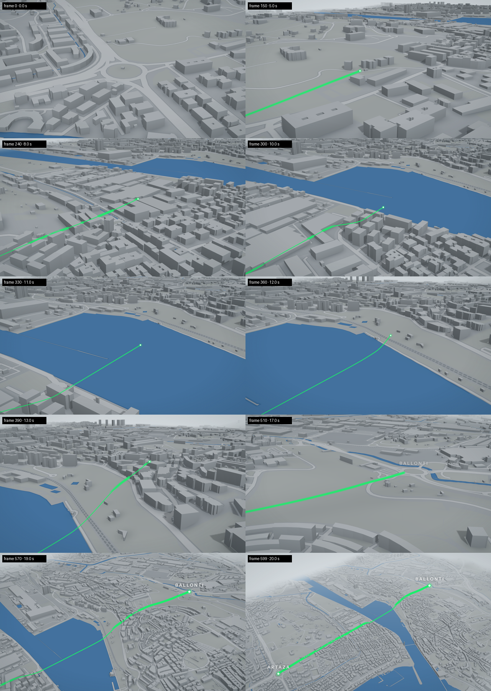

# SUBFLUVIAL · Artaza → Ballonti

Animación territorial 3D de 20 s (1920×1080, 30 fps) en **Remotion + three.js**, construida sobre la
**arquitectura y el territorio reales** del entorno: huellas de edificios con altura, viario, ría y relieve.



## Uso

```bash
npm install
npm run dev            # Remotion Studio: revisión fotograma a fotograma
node scripts/preview-stills.mjs 0 60 150 599   # fotogramas sueltos en out/stills/
npm run render         # MP4 final (solo tras aprobar movimiento y estética)
```

Si el entorno no puede descargar Chrome Headless Shell, indica un Chromium local:
`REMOTION_BROWSER=/ruta/a/headless_shell npm run dev`.

## Acabado Google 3D (Photorealistic 3D Tiles)

Composición `ArtazaBallontiGoogle`: el vuelo sobre las teselas 3D fotorrealistas de Google (Map Tiles API),
con la línea verde superpuesta en el mismo espacio 3D. Sin etiquetas (solo la atribución obligatoria de Google,
desactivable en `CONFIG.google.attribution`).

```bash
echo "GOOGLE_MAPS_API_KEY=tu_clave" > .env.local          # no se versiona
NODE_USE_ENV_PROXY=1 node scripts/tiles-proxy.mjs &      # añade la clave y cachea teselas en data/cache/
npx remotion render ArtazaBallontiGoogle out/google.mp4 --gl=angle --concurrency=3 --timeout=600000
```

## Acabado realista (tipo Google Earth)

Composición `ArtazaBallontiRealista`: ortofoto sobre el relieve y los tejados, fachadas, bruma atmosférica y
**sin textos**. Ajustes en `CONFIG.real`. La ortofoto se genera con:

```bash
python3 scripts/fetch_ortho.py --source pnoa --res 0.5      # PNOA del IGN (recomendada, ~0,25 m/px)
python3 scripts/fetch_ortho.py --source sentinel2 --res 2   # Sentinel-2, 10 m/px (solo provisional)
```

Render: `npx remotion render ArtazaBallontiRealista out/artaza-ballonti-realista.mp4`

## Estructura

| Fichero | Función |
| --- | --- |
| `src/data/config.ts` | **CONFIG central**: colores, keyframes de cámara, crecimiento de la línea, etiquetas, luz, bruma |
| `src/data/geo.json` | Coordenadas de Artaza y Ballonti y margen del territorio (compartido con el script de datos) |
| `src/data/route.ts` | Proyección al marco local, relieve, eje del trazado y bajada simbólica bajo la ría (`CONFIG.route.dip`) |
| `src/components/Territory.tsx` | Suelo (usos, agua, viario, sombra ambiental), relieve y edificios extruidos |
| `src/components/RouteLine.tsx` | Línea verde de grosor estable en pantalla, con halo y lectura «radiografía» |
| `src/components/CameraRig.tsx` | Cámara por keyframes (interpolación monótona, zoom logarítmico) |
| `src/components/MarkerLabel.tsx` | Puntos de origen/destino y las dos únicas etiquetas: ARTAZA y BALLONTI |
| `src/ArtazaBallonti.tsx`, `src/Root.tsx` | Composición |
| `public/territory.json` | Territorio real ya procesado (se regenera con los scripts) |

## Datos

- **Edificios, agua, viario y usos del suelo**: [Overture Maps Foundation](https://overturemaps.org)
  (release 2026‑09‑23.1), que integra OpenStreetMap y otras fuentes abiertas. Alturas reales cuando existen
  (`height` / `num_floors`); en el resto, estimadas según tipo y superficie.
- **Relieve**: Mapzen Terrain Tiles (Terrarium, AWS Open Data).
- Coordenadas verificadas sobre los datos: el punto de Artaza (43.333060, −3.001810) cae en el centro de la
  gran rotonda; el de Ballonti (43.306243, −3.015766) en el centro de la rotonda próxima al centro comercial.

Regenerar:

```bash
pip install pyarrow shapely scipy pillow
npm run data:fetch     # descarga a data/raw/ (no versionado)
npm run data:build     # genera public/territory.json
```

Atribución obligatoria en créditos: «© OpenStreetMap contributors (ODbL) · Overture Maps Foundation ·
Mapzen Terrain Tiles». Tipografía Instrument Sans (SIL OFL) incluida en `public/fonts/`.

## Por qué no Google Maps 3D / MapLibre

Google Photorealistic 3D Tiles exige clave de API y tiene condiciones de uso propias que habría que revisar
para vídeo; además su aspecto es fotogramétrico (más cercano a Google Earth que al estilo pedido). Los vectores de OpenFreeMap
no eran accesibles desde este entorno. Overture ofrece las mismas huellas (OSM) con alturas y se renderiza con
control total del estilo: grises Google‑Maps‑3D, ría azul plana y línea verde, sin POIs ni rótulos.
